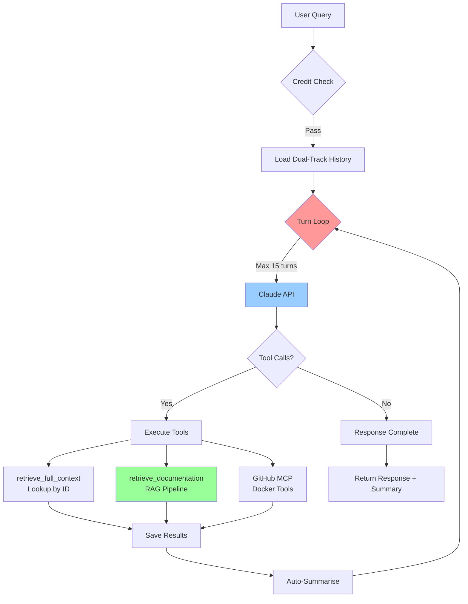
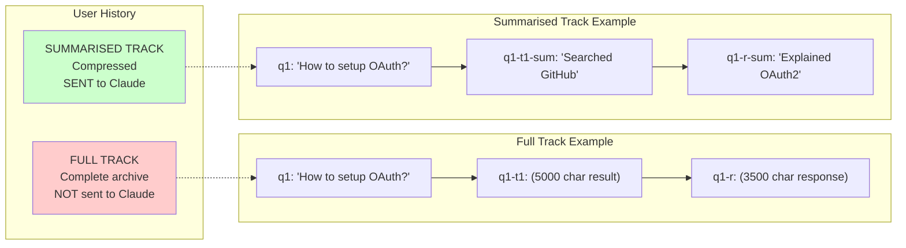

# KlerAI

> AI chat application with dual-track memory management and multi-turn reasoning

**Reduces token costs by ~60% whilst enabling complex multi-step workflows**

[](https://fastapi.tiangolo.com/)
[](https://nextjs.org/)
[](https://www.anthropic.com/)
[](https://www.python.org/)

---

## What is KlerAI?

**KlerAI is an AI-powered coding assistant designed to help developers write code efficiently by combining API documentation and GitHub repositories.**

Instead of manually searching through documentation, switching between tabs, and piecing together examples, KlerAI:

✅ **Retrieves relevant API documentation** automatically from Context7's database
✅ **Searches GitHub repositories** for real-world implementation examples
✅ **Synthesises complete solutions** by combining docs + code examples
✅ **Maintains conversation context** without expensive token costs

### Use Cases

**"How do I implement Stripe webhooks?"**
→ Fetches Stripe API docs + searches GitHub for webhook examples → provides complete implementation

**"Show me how to authenticate with Twitter ads API"**
→ Retrieves X API OAuth documentation + finds working code samples → explains setup with examples

**"How to use OpenAI's streaming API in Python?"**
→ Gets OpenAI API docs + searches for streaming implementations → provides working code

**Perfect for**: Building integrations, learning new APIs, rapid prototyping, and implementation guidance

---

## The Problem

When building AI chat applications, you face a dilemma:

**Option 1**: Send full conversation history → Accurate but expensive
**Option 2**: Summarise everything → Cheap but loses critical details

Most solutions force you to choose one. **KlerAI does both.**

---

## The Solution: Dual-Track Memory

KlerAI maintains **two parallel conversation histories** for every user:

```
┌─────────────────────────────────────────────────────────┐
│                   USER CONVERSATION                     │
├─────────────────────────────────────────────────────────┤
│                                                         │
│  TRACK 1: FULL HISTORY                                  │
│  ├─ [ID:q1] User: "How to setup OAuth for Twitter?"     │
│  ├─ [ID:q1-t1] Tool: (5000 char GitHub search result)   │
│  └─ [ID:q1-r] Assistant: (3500 char implementation)     │
│                                                         │
│  TRACK 2: SUMMARISED HISTORY (sent to AI)               │
│  ├─ [ID:q1] User: "How to setup OAuth for Twitter?"     │
│  ├─ [ID:q1-t1-sum] "Searched GitHub, found 3 repos"     │
│  └─ [ID:q1-r-sum] "Explained OAuth2 flow with code"     │
│                                                         │
│  TOKEN SAVINGS: ~60%                                    │
└─────────────────────────────────────────────────────────┘
```

### How It Works

1. **Every message gets a unique ID** (q1, q1-r, q1-t1)
2. **Full history is archived** but never sent to the AI
3. **Summarised version is sent** to Claude for context
4. **When AI needs details**, it calls `retrieve_full_context` with the ID

**Result**: Fast, cheap context scanning + precise retrieval when needed

---

## Architecture: Multi-Turn Reasoning Loop

KlerAI uses a **turn-based orchestration loop** that enables complex workflows:

### Example Query: "How do I implement Stripe webhooks?"

```
┌─────────────────────────────────────────────────────────┐
│ TURN 1: Claude analyses query                           │
│ └─> Calls retrieve_documentation tool                   │
│     └─> Context7 API fetches Stripe docs                │
│     └─> Hybrid search (BM25 + Vector embeddings)        │
│     └─> Claude reranks top 6 results                    │
│     └─> Returns documentation                           │
├─────────────────────────────────────────────────────────┤
│ TURN 2: Claude searches for code examples               │
│ └─> Calls search_repositories (GitHub MCP)              │
│     └─> Searches GitHub via Docker MCP server           │
│     └─> Finds Stripe webhook examples                   │
│     └─> Automatically summarises results                │
├─────────────────────────────────────────────────────────┤
│ TURN 3: Claude synthesises final response               │
│ └─> Combines docs + code examples                       │
│ └─> Provides complete implementation guide              │
└─────────────────────────────────────────────────────────┘

Cost: 5 (base) + 10 (docs) + 3 (GitHub) = 18 credits
Max turns: 15 (prevents infinite loops)
```

---

## System Flow Diagram

See detailed architecture in [TOOL_ORCHESTRATION_FLOW.md](TOOL_ORCHESTRATION_FLOW.md)

### High-Level Flow



### Dual-Track Memory Visualisation



---

## Three Tool Categories

### 1. retrieve_full_context (Free)
**Purpose**: Retrieve complete message when summary insufficient

```python
User: "Show me that OAuth code again"
→ Claude sees summary: "Explained OAuth2 flow"
→ Realizes needs full content
→ Calls retrieve_full_context(id="q1-r")
→ Returns complete 3500-char implementation
```

### 2. retrieve_documentation (+10 credits)
**Purpose**: External API documentation with RAG

**Pipeline**:
1. Query Context7 API for doc name
2. Claude selects best document
3. Chunk documentation by sections
4. Hybrid search: BM25 (keyword) + Vector (semantic)
5. Reciprocal Rank Fusion merges results
6. Claude reranks top 30 → returns top 6

**Why hybrid search?** Catches both exact terminology AND conceptually similar content

### 3. GitHub MCP Tools (+3 credits each)
**Purpose**: Dynamic repository operations

- Runs in Docker via Model Context Protocol
- **Filtered to 7 read-only tools** (from 92 available) for security:
  - `search_repositories`, `get_file_contents`, `search_code`
  - `list_commits`, `get_commit`, `list_issues`, `search_issues`
- **Blocks**: All create, delete, update operations
- Results automatically summarised and saved to both tracks

---

## RAG Pipeline Deep Dive

```
User Query: "Twitter OAuth setup"
         ↓
    ┌────────────────┐
    │ Claude parses  │  → doc_name: "X API"
    │ query          │  → topic: "OAuth setup"
    └────────────────┘
         ↓
    ┌────────────────┐
    │ Context7 API   │  → Search for "X API"
    │ search         │  → Returns matching docs
    └────────────────┘
         ↓
    ┌────────────────┐
    │ Claude selects │  → Picks best doc ID
    │ document       │
    └────────────────┘
         ↓
    ┌────────────────┐
    │ Retrieve full  │  → GET /docs/{id}?topic=OAuth
    │ documentation  │  → Up to 50,000 tokens
    └────────────────┘
         ↓
    ┌────────────────┐
    │ Chunk by       │  → Split on section delimiters
    │ section        │
    └────────────────┘
         ↓
    ┌────────────────┐
    │ Query          │  → Claude decomposes into 4-5
    │ Decomposition  │  → focused sub-queries
    └────────────────┘
         ↓
    ┌────────────────────────────────┐
    │ MULTI-QUERY HYBRID SEARCH      │
    │                                │
    │  For each sub-query:           │
    │  BM25 Index        Vector Index│
    │  (keyword)         (semantic)  │
    │     ↓                  ↓       │
    │     └─── RRF Fusion ───┘       │
    │           Top 3 per query      │
    └────────────────────────────────┘
         ↓
    ┌────────────────┐
    │ Collect all    │  → 12-15 chunks total
    │ results        │  → Better coverage
    └────────────────┘
         ↓
    ┌────────────────┐
    │ Format and     │  → Shows doc name
    │ return         │  → Shows sub-queries used
    │                │  → Markdown-formatted docs
    └────────────────┘
```

**VoyageAI** provides embeddings (voyage-3-large model)
**BM25** uses TF-IDF for keyword matching
**Claude** performs query decomposition and intelligent search

---

## ID-Based Reference System

Every piece of content gets a unique ID for precise tracking:

```
QUERIES       → q1, q2, q3, ...
RESPONSES     → q1-r, q2-r, q3-r, ...
TOOL RESULTS  → q1-t1, q1-t2, q2-t1, ...
SUMMARIES     → q1-r-sum (references q1-r)
               q1-t1-sum (references q1-t1)
```

### Example Conversation

```
[ID:q1] User: "How to implement OAuth for Twitter?"

[ID:q1-t1] Tool: retrieve_documentation
  → Full: 8000 characters of X API documentation
  → Summary: "Retrieved X API OAuth docs with setup steps"

[ID:q1-t2] Tool: search_repositories
  → Full: 12 repositories with code examples
  → Summary: "Found 12 repos with OAuth implementations"

[ID:q1-r] Assistant: (3500 char response with code)
  → Summary: "Explained OAuth2 flow with example implementation"

─────────────────────────────────────────────────

[ID:q2] User: "Show me that code again"

[ID:q2-retrieval] Tool: retrieve_full_context(id="q1-r")
  → Returns complete 3500-char code from q1-r

[ID:q2-r] Assistant: "Here's the complete OAuth code..."
```

**Benefit**: Clear audit trail + efficient retrieval without re-sending context

---

## Credit System

### Transparent Cost Tracking

```
Base Query:                  5 credits
+ retrieve_documentation:   10 credits
+ Each GitHub MCP tool:      3 credits
+ Other tools:               2 credits each
```

### Example Costs

| Query | Tools | Cost |
|-------|-------|------|
| "What is OAuth?" | None | 5 credits |
| "How does Stripe API work?" | retrieve_documentation | 15 credits |
| "Find GraphQL examples" | retrieve_documentation + search_repositories | 18 credits |
| Complex multi-step query | docs + 3 GitHub tools | 24 credits |

### Plans

- **Free**: 50 credits/day (resets daily)
- **Pro**: $19/month → 150 credits/day (max 3,000/month)
- **Credit Packs**: Starting at $20 for 500 credits

---

## Tech Stack

### Backend (Python)
- **FastAPI**: Async API server with SSE streaming
- **Anthropic Claude Haiku**: Primary reasoning engine (claude-haiku-4-5-20251001)
- **VoyageAI**: Vector embeddings for semantic search
- **Context7**: External API documentation retrieval
- **MCP**: Model Context Protocol for GitHub integration
- **Docker**: GitHub MCP server runtime

### Frontend (TypeScript)
- **Next.js 15**: React framework with Turbopack
- **Tailwind CSS v4**: Styling
- **Supabase**: Authentication + PostgreSQL database
- **Server-Sent Events**: Real-time streaming

### Search & Retrieval
- **BM25 Index**: TF-IDF keyword search (k1=1.5, b=0.75)
- **Vector Index**: Cosine distance with VoyageAI embeddings
- **Retriever**: Reciprocal Rank Fusion with optional reranking

---

## Advanced Features

### 🔍 Query Decomposition

Complex queries are automatically broken down into 4-5 focused sub-queries for comprehensive documentation coverage.

**Example**: "How to setup Telegram Bot API with webhooks"

Becomes:
- "Telegram Bot API authentication and setup"
- "Telegram Bot webhook configuration"
- "Telegram Bot webhook security"
- "Telegram Bot error handling"
- "Telegram Bot best practices"

Each sub-query searches for top 3 chunks → **12-15 total chunks** with better topical coverage

### 🔒 GitHub Tool Filtering

Security-first approach: Only 7 read-only GitHub tools are available (from 92 total):
- ✅ search_repositories, get_file_contents, search_code
- ✅ list_commits, get_commit, list_issues, search_issues
- ❌ All create, delete, update, write operations blocked

### 📋 Documentation Transparency

Users see exactly:
- **Which API documentation** was searched (e.g., "Telegram Bot API")
- **Which sub-queries** were used to find information
- **Numbered chunks** for easy reference

Example output:
```
Documentation for 'Telegram Bot API':

Search queries used:
  - Telegram Bot API authentication
  - Telegram Bot webhook setup

[Doc 1]
API authentication requires...
```

### ⚡ Debounced Documentation Search

Slash command (`/`) searches Context7 with 700ms debounce to:
- Reduce API calls by 80-90%
- Prevent rate limiting
- Allow multi-word searches (`/stripe webhook` works!)
- Double-space to exit search mode

---

## Key Innovations

### 1. Dual-Track Memory (~60% Token Reduction)
Instead of choosing between accuracy and cost, maintain both:
- Full track for archive
- Summarised track for API calls
- Smart retrieval bridges the gap

### 2. Multi-Turn Orchestration
Single API calls can't handle: "Find the SDK, explain its methods, show examples"

Multi-turn loop enables:
```
Search → Retrieve → Analyse → Synthesise → Respond
```

### 3. Multi-Query Hybrid Search (Better than Single Method)
**BM25 alone**: Misses semantically similar content
**Vector alone**: Misses exact terminology matches
**BM25 + Vector + RRF + Query Decomposition**: Best of all worlds

Decomposes complex queries into focused sub-queries, searches each independently for broader coverage

### 4. Automatic Summarisation
- Tool results summarised by Claude
- Responses summarised for next conversation
- Maintains context whilst reducing tokens

### 5. ID-Based References
- Every message tracked with unique ID
- Clear audit trail
- Efficient retrieval without context duplication

---

## Performance Characteristics

| Metric | Value |
|--------|-------|
| Token Reduction | ~60% via dual-track memory |
| Max Query Cost | ~25 credits |
| Turn Limit | 15 (prevents infinite loops) |
| API Timeout | 30s (Context7), 120s (chat) |
| Streaming | SSE for real-time updates |
| Concurrency | Parallel tool execution |

---

## Real-World Example

**Query**: "How do I implement Stripe payment intents with webhooks?"

**Turn 1** (5 credits):
- Claude calls `retrieve_documentation`
- Context7 fetches Stripe API docs
- Hybrid search finds "Payment Intents" + "Webhooks" sections
- Returns top 6 relevant chunks
- Saves: `[ID:q1-t1]` full, `[ID:q1-t1-sum]` summary

**Turn 2** (+3 credits):
- Claude calls `search_repositories`
- GitHub MCP finds Stripe webhook examples
- Saves: `[ID:q1-t2]` with code, `[ID:q1-t2-sum]` summary

**Turn 3** (final):
- Claude synthesises response
- Combines docs + examples
- Provides implementation guide
- Saves: `[ID:q1-r]` 3500 chars, `[ID:q1-r-sum]` 80 chars

**Total**: 18 credits

**Next Query**: "Show me that webhook code again"
- Claude sees summary, calls `retrieve_full_context(id="q1-r")`
- Returns complete code
- Cost: 5 credits (no new tools)

---

## Why This Architecture Works

✅ **Scalable**: In-memory histories (can add Redis/PostgreSQL)
✅ **Cost-Efficient**: 60% token reduction without losing accuracy
✅ **Observable**: Clear ID-based audit trail
✅ **Extensible**: Easy to add tools via MCP protocol
✅ **User-Friendly**: Streaming responses, transparent costs

---

## Learn More

📖 [Tool Orchestration Flow Diagrams](TOOL_ORCHESTRATION_FLOW.md) - Detailed Mermaid diagrams
📖 [CLAUDE.md](CLAUDE.md) - Development guide and codebase overview

---

## Built With

**AI**: Claude API (Anthropic), VoyageAI embeddings
**Backend**: FastAPI, Python 3.11
**Frontend**: Next.js 15, TypeScript, Tailwind CSS v4
**Database**: Supabase (PostgreSQL + Auth)
**Infrastructure**: Docker (MCP), Stripe (payments)

---

**Designed to balance accuracy and cost whilst enabling complex AI reasoning workflows**

⭐ Star this repo if you find the architecture interesting!
