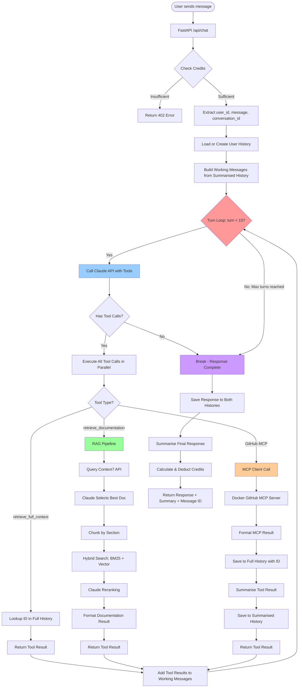
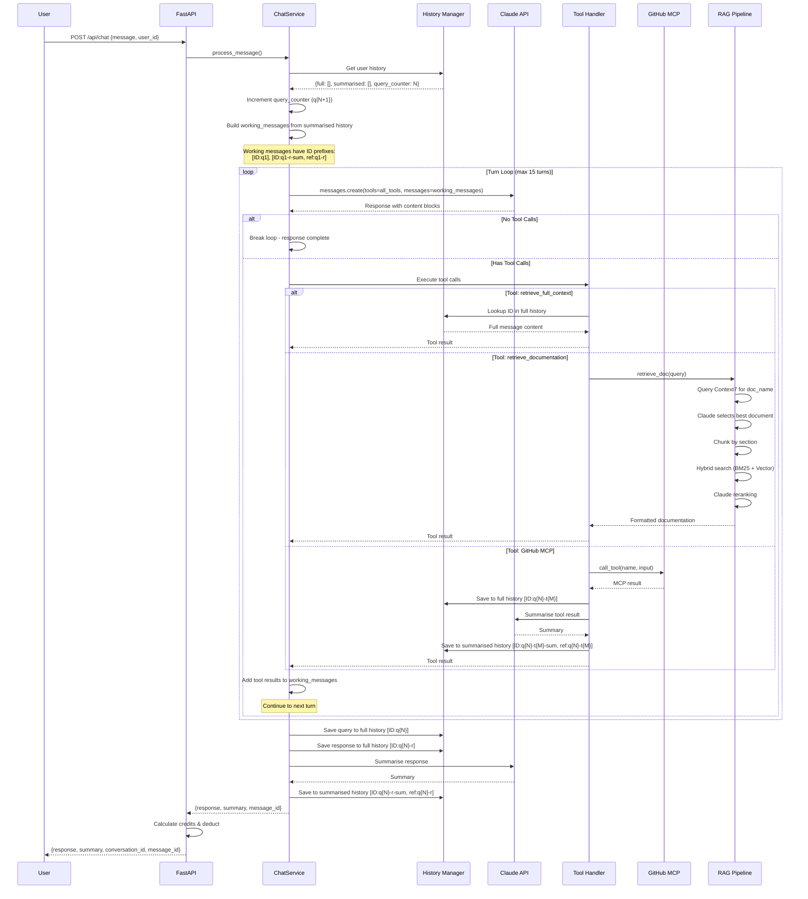
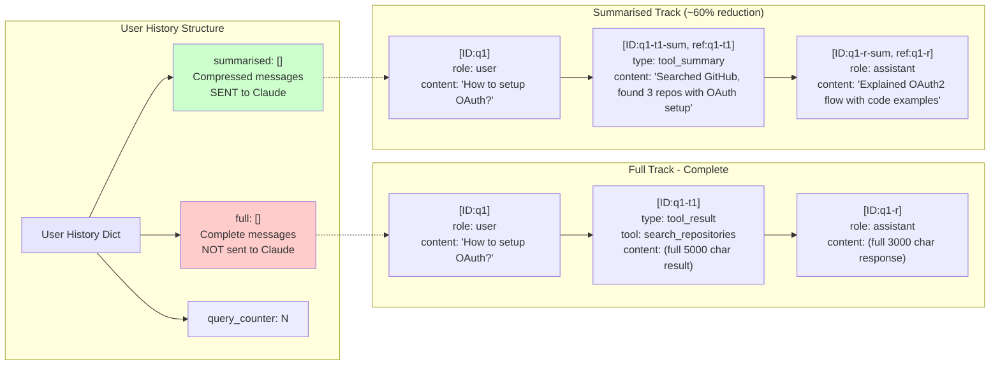
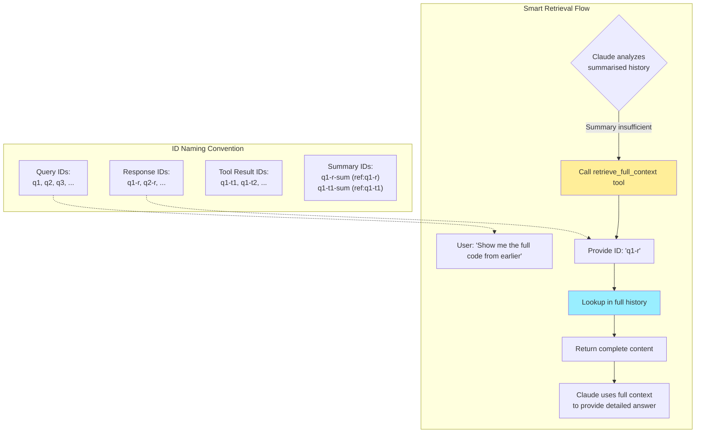
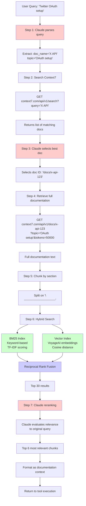
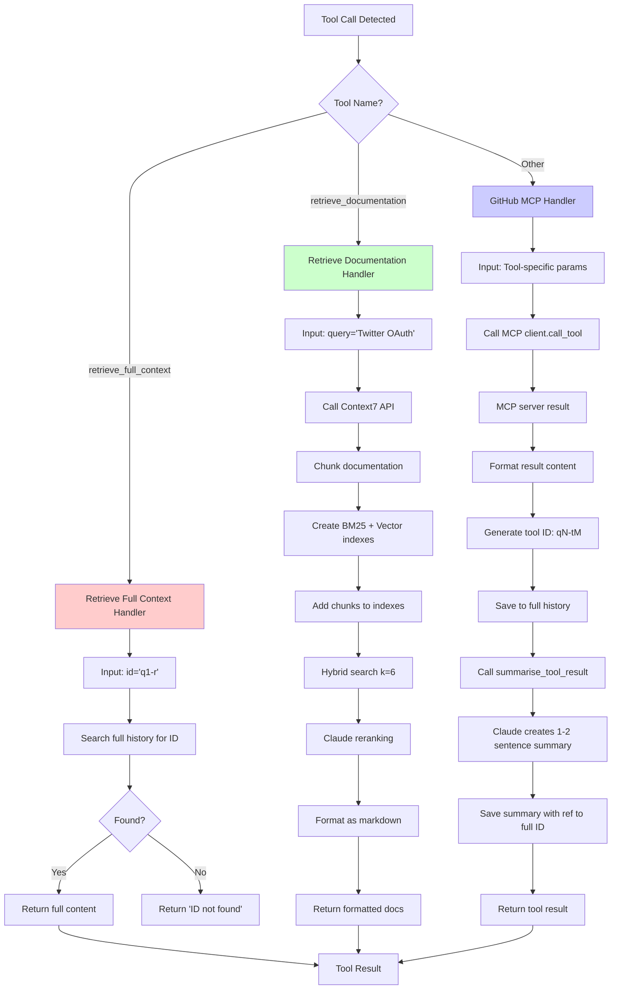
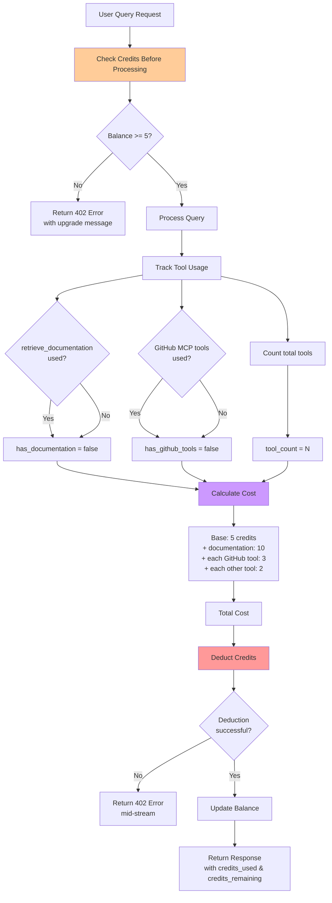

# Tool Orchestration Flow Diagram

## System Architecture: Dual-Track Memory with Multi-Turn Reasoning

This system manages retrieval-augmented reasoning, multi-turn tool usage, and dual-track memory for efficient AI agent orchestration.

---

## High-Level Flow Diagram

---

## Detailed Turn Loop Architecture

---

## Dual-Track Memory System

---

## ID System & Smart Retrieval

---

## RAG Pipeline Details

---

## Tool Execution Handler

---

## Credit System Integration

---

## Key Features

### 1. Multi-Turn Reasoning
- Enables complex workflows: Search GitHub → Retrieve SDK → Fetch API docs → Generate code
- Max 15 turns with automatic loop termination when response is complete

### 2. Dual-Track Memory (~60% Token Reduction)
- **Full Track**: Complete messages stored but NOT sent to Claude
- **Summarised Track**: Compressed versions sent to Claude for efficiency
- Smart retrieval when summaries are insufficient

### 3. ID-Based Reference System
- Unique IDs for every message, response, and tool result
- Enables precise retrieval and context reconstruction
- References link summaries to full content

### 4. Three Tool Categories
1. **retrieve_full_context**: Internal history lookup
2. **retrieve_documentation**: RAG with Context7 API + hybrid search
3. **GitHub MCP**: Dynamic tools from Docker-based MCP server

### 5. RAG Pipeline
- Context7 API for external documentation
- Hybrid search: BM25 (keyword) + Vector (semantic)
- Reciprocal Rank Fusion for result merging
- Claude-powered reranking for optimal relevance

### 6. Automatic Summarisation
- Tool results summarised by Claude
- Final responses summarised for next conversation
- Maintains context while reducing token usage

---

## Technical Stack

### Backend Components
- **FastAPI**: API server with streaming support
- **Anthropic Claude**: Primary reasoning engine (claude-haiku-4-5-20251001)
- **VoyageAI**: Embeddings for vector search (voyage-3-large)
- **Context7**: External API documentation retrieval
- **MCP (Model Context Protocol)**: GitHub tool integration via Docker
- **Docker**: GitHub MCP server runtime

### Search & Retrieval
- **BM25Index**: TF-IDF keyword search with configurable k1/b parameters
- **VectorIndex**: Cosine/Euclidean distance with VoyageAI embeddings
- **Retriever**: RRF fusion with optional Claude reranking
- **httpx**: Async HTTP client for Context7 API

### Memory Management
- In-memory dictionaries per user (ephemeral, not persisted)
- Dual-track histories (full + summarised)
- Automatic query counter for ID generation

---

## Example Conversation Flow

**Query 1**: "How do I set up OAuth for Twitter ads?"

1. **Turn 1**: Claude calls `retrieve_documentation` tool
   - Context7 API fetches X API documentation
   - RAG pipeline retrieves relevant OAuth sections
   - Tool result saved: `[ID:q1-t1]` (full), `[ID:q1-t1-sum, ref:q1-t1]` (summarised)

2. **Turn 2**: Claude calls `search_repositories` (GitHub MCP)
   - Searches for Twitter ads examples
   - Result saved: `[ID:q1-t2]` (full), `[ID:q1-t2-sum, ref:q1-t2]` (summarised)

3. **Turn 3**: Claude provides final response
   - Explains OAuth flow with code examples
   - Response saved: `[ID:q1-r]` (full), `[ID:q1-r-sum, ref:q1-r]` (summarised)

**Query 2**: "Show me the full code from earlier"

1. **Turn 1**: Claude analyzes summarised history, realizes summary insufficient
   - Calls `retrieve_full_context` with `{id: "q1-r"}`
   - Receives complete code from full history

2. **Turn 2**: Claude provides detailed code explanation
   - Uses retrieved full context

---

## Performance Characteristics

- **Token Efficiency**: ~60% reduction through dual-track memory
- **Max Query Cost**: Base 5 + documentation 10 + tools (2-3 each) = ~25 credits
- **API Timeouts**: 30s for Context7, 120s for chat
- **Streaming**: SSE (Server-Sent Events) for real-time updates
- **Turn Limit**: 15 turns to prevent infinite loops
- **Concurrency**: Parallel tool execution within single turn

---

## Credit Pricing Model

### Base Costs
- **Minimum Query**: 5 credits
- **With Documentation**: +10 credits (retrieve_documentation tool)
- **Per GitHub Tool**: +3 credits each
- **Per Other Tool**: +2 credits each

### Plans
- **Free**: 50 credits/day (resets daily)
- **Pro**: $19/month for 150 credits/day (max 3,000/month)
- **Credit Packs**: Starting at $20 for 500 credits (one-time purchase)

### Example Costs
- Simple query: 5 credits
- Query + documentation: 15 credits
- Query + docs + 2 GitHub tools: 21 credits
- Complex query with multiple tools: ~25 credits

---

## Architecture Benefits

1. **Stateful Reasoning**: Multi-turn loops enable complex problem solving
2. **Cost Efficient**: Dual-track memory reduces token usage by ~60%
3. **Explainable**: ID system provides clear audit trail
4. **Extensible**: Easy to add new tools via MCP protocol
5. **Hybrid Search**: Combines keyword and semantic search for best results
6. **Smart Caching**: Context7 API results cached for repeated queries
7. **Credit Control**: Fine-grained cost tracking per tool usage

---

*Generated for KlerAI - Full-stack AI chat application with RAG capabilities*
